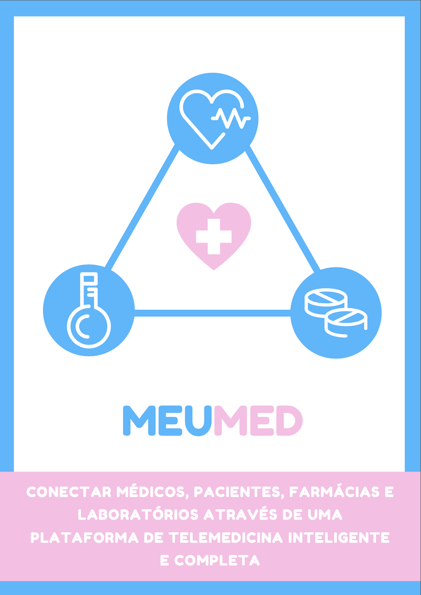

# DocBe!

## Ideia

Nosso objetivo é conectar médicos, pacientes, farmácias e laboratórios de todo o Brasil através de uma plataforma de Telemedicina inteligente e completa. Assim, utilizando certificados digitais, armazenamento na nuvem e videochamadas, reduziremos a burocracia e garantiremos maior segurança e comodidade aos usuários dos serviços de saúde.

## Organização do proketo

O projeto utiliza a abordagem de MERN, em outras palavras utilizamos os sguintes frameworks, linguagens e serviços:

- React
- Express
- MongoDB
- Redux
- NodeJS

O projeto está divido em duas pastas:

- client --> front end
- back --> back end

## Documentação de cada parte

### Front

#### Lógica de login

### Back

#### organização dos arquivos

1) Foi utilizado duas abordagens, separação de controllers e routes para abrir um serviço de POST e GET de uma dada funcionalidade. Mas também foi utilizado arquivos únicos que implementam tanto a parte de controller quanto a parte de route. Como por exemplo os arquivos drug.js e user.js dentro da pasta routes. Então não se assuste ao ver os dois padrões :)

## Cartilha de apresentação

<object  
type="application/pdf" width="700px" height="700px">
    <embed src="./cartilha/HackathonCoronavirus3.0.pdf">
        
This browser does not support PDFs. Please download the PDF to view it. <a href="./cartilha/HackathonCoronavirus3.0.pdf">Click here!</a>.

    </embed>
</object>